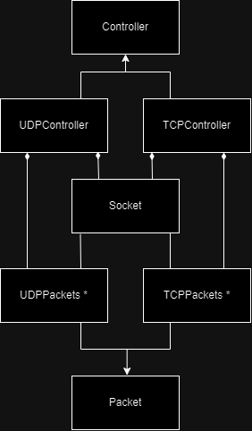

# IPK24 Chat Client

C++ klient pre školský projekt z predmetu IPK na FIT VUT. Aplikácia jednoduchého chat klienta pre protokoly TCP aj UDP podľa projektovej špecifikácie `IPK24-CHAT`.

Repozitár pokrýva celý priebeh riešenia od návrhu až po testovanie a známe obmedzenia. README zároveň obsahuje stručný prehľad, návod na zostavenie a spustenie, aby bol projekt čitateľný aj bez znalosti pôvodného zadania.

## Obsah

1. [Funkcionalita](#funkcionalita)
2. [Zostavenie](#zostavenie)
3. [Spustenie](#spustenie)
4. [Návrh](#návrh)
5. [Implementácia](#implementácia)
6. [Testovanie](#testovanie)
7. [Limitácie](#limitácie)
8. [Odkazy](#odkazy)

## Funkcionalita

- komunikácia so serverom cez TCP alebo UDP,
- spracovanie používateľských príkazov `/auth`, `/join`, `/rename` a `/help`,
- validácia vstupov od používateľa aj správ prijatých zo servera,
- samostatné spracovanie TCP a UDP paketov,
- riadenie komunikácie pomocou konečného stavového automatu.

## Zostavenie

Projekt je určený pre Linuxové/POSIX prostredie a používa `make` a `g++` s podporou C++20.

```sh
make
```

Výsledkom je binárka:

```sh
./ipk24chat-client
```

Vyčistenie build artefaktov:

```sh
make clean
```

## Spustenie

Program očakáva minimálne protokol a adresu servera:

```sh
./ipk24chat-client -t tcp -s <server>
./ipk24chat-client -t udp -s <server>
```

Podporované argumenty:

| Argument | Popis |
| --- | --- |
| `-t tcp|udp` | použitý transportný protokol |
| `-s <server>` | adresa servera |
| `-p <port>` | port servera, predvolene `4567` |
| `-d <timeout>` | UDP timeout v milisekundách |
| `-r <count>` | počet UDP retransmisií |

## Návrh

Základom návrhu je trieda `Controller`, ktorá má dve konkrétne varianty: `TCPController` a `UDPController`. Controller riadi komunikáciu pomocou konečného stavového automatu a oddeľuje protokolovo špecifické správanie od zvyšku aplikácie.

Trieda `Socket` zabezpečuje pripojenie k serveru, odosielanie a prijímanie dát. Je spoločná pre TCP aj UDP a o použitom protokole rozhoduje konfigurácia pri vytvorení spojenia.

Trieda `Packet` má rovnako TCP aj UDP varianty. Udržiava informácie o konkrétnej správe a umožňuje zostaviť dáta v tvare očakávanom serverom. O spracovanie vstupov, používateľských príkazov a správ prijatých zo servera sa stará `Parser`.



*Zjednodušený diagram tried. Hviezdička reprezentuje všetky triedy packetov daného protokolu.*

## Implementácia

Ako prvá bola implementovaná TCP časť aplikácie, pri ktorej som sa snažil myslieť na neskoršie znovupoužitie logiky pre UDP. Po otestovaní TCP varianty som projekt rozšíril o UDP, čo si vyžiadalo doplnenie novej funkcionality aj úpravu niektorých pôvodných TCP tried.

Na konci bola aplikácia prispôsobená požiadavkám zadania, hlavne v oblasti spracovania argumentov, štruktúry odovzdania a `Makefile`.

## Testovanie

Testovanie prebiehalo prevažne manuálne pomocou nástrojov **Wireshark** a **netcat**. Kontroloval som vstupné dáta od používateľa, správy prijaté zo servera a správanie pri nevalidných alebo náhodne vytvorených vstupoch.

Ako referenčné vstupy a výstupy slúžilo zadanie projektu a súbory so zachytenou komunikáciou. Pri kontrole UDP bol použitý aj pomocný Python skript na overenie vybraných problémových situácií spojených s UDP komunikáciou. Tento skript nebol súčasťou finálneho automatizovaného testovania, slúžil skôr ako vývojová pomôcka.

## Limitácie

Projekt vznikol ako školské zadanie, preto sa zameriava najmä na správanie definované špecifikáciou. Situácie, ktoré špecifikácia jednoznačne nepopisuje, nemusia byť pokryté úplne deterministicky.

Známe obmedzenia:

- aplikácia nie je navrhnutá ako bezpečnostne odolný sieťový klient,
- správanie pri neočakávaných správach zo servera je pokryté len v rozsahu testovaných prípadov,
- UDP časť očakáva po odoslaní paketu príchod príslušného potvrdzovacieho paketu,
- ide o jeden z prvých väčších projektov, ktoré som písal v C++, takže niektoré časti by sa dnes dali navrhnúť všeobecnejšie.

## Odkazy

- [Zadanie projektu](https://git.fit.vutbr.cz/NESFIT/IPK-Projects-2024/src/branch/master/Project%201)
- [C++ reference](https://en.cppreference.com/w/)
- [Wireshark](https://www.wireshark.org/)
- [Netcat](https://nc110.sourceforge.io/)
